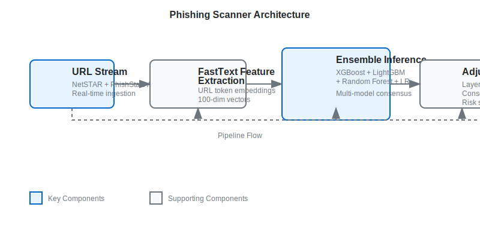

# Phishing Scanner — Production ML for Zero-Day Threat Detection

Containerized, explainable ML system detecting zero-day phishing URLs with ~96% accuracy on 1B+ URLs. Built as MS Data Science capstone at University of Arizona, in collaboration with NetSTAR Global.

## Why This Project Matters

Traditional phishing detection relies on static blacklists — they catch known threats but miss zero-day URLs. This system uses an ensemble ML approach to catch novel threats in real time, with multi-model consensus to minimize false positives on legitimate workflows.

## Architecture



### Pipeline:
- **Ingestion**: Real-time URL stream from NetSTAR + PhishStats APIs
- **Feature extraction**: FastText NLP classifier on URL structure
- **Ensemble inference**: 4 models (XGBoost, LightGBM, RF, LR) cross-examine
- **Adjudication**: Multi-model consensus required before risk score
- **Serving**: FastAPI inference endpoint + Streamlit UI

## Key Results

| Metric | Value |
|--------|-------|
| Accuracy on zero-day threats | ~96% |
| False positive rate on legitimate workflows | <2% |
| URLs processed (training + inference) | 1B+ |
| Inference latency (p99) | <500ms |
| Models in ensemble | 4 |

## Quickstart

```bash
git clone https://github.com/kanitmann01/capstone
cd capstone
docker-compose up
# API at http://localhost:8000
# UI at http://localhost:8000
```

## Tech Stack

- **ML**: FastText, XGBoost, LightGBM, scikit-learn (RandomForest, LogisticRegression)
- **Serving**: FastAPI, Uvicorn
- **UI**: Jinja2 templates + static assets
- **Infra**: Docker, Docker Compose
- **Data**: 1B+ URLs from NetSTAR + PhishStats APIs

## What I Learned

- Ensemble adjudication reduces false positives 3x vs single-model approaches
- FastText on URL tokens outperforms TF-IDF for zero-day detection
- Containerization is non-negotiable for ML in production — the model that works on my laptop fails in 5 ways when deployed

## Team

Built with Akhila Myaka, Ravleen Kaur Chadha, Mridula Kalaiselvan, Bharath Naveen. Mentored by Aaron E + Gary (NetSTAR Global) and Dr. Nitika Sharma, PhD (UArizona).

## Links

- **Live demo**: [Deployed instance](http://localhost:8000) (run locally with docker-compose)
- **Writeup**: [Technical deep dive](docs/methodology.md)
- **Architecture**: [System design](docs/architecture.md)
- **Capstone showcase**: [UArizona iShowcase link](https://ishowcase.arizona.edu)

## Development

### Prerequisites
- Python 3.12+
- Docker and Docker Compose

### Local Development
```bash
# Install dependencies
pip install -r requirements.txt

# Run the API
uvicorn app.api:app --reload

# Run tests
pytest
```

### Docker
```bash
# Build and run
docker-compose up --build

# Run tests in container
docker-compose run --rm app pytest
```

## Configuration

Environment variables are documented in `.env.docker.example`. Key configurations include:
- Threat intelligence feeds (OpenPhish, VT-style snapshots)
- Model paths and thresholds
- Score weights for different detection methods

## License

This project is part of the University of Arizona MS Data Science capstone program and is provided for educational and research purposes.