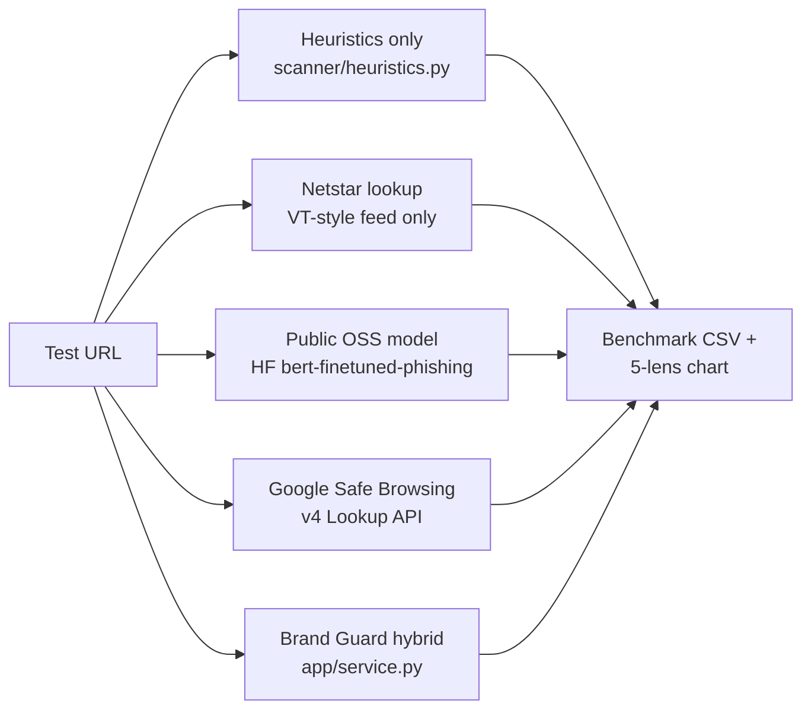

## Why this comparison

Judges respond to a clear taxonomy of "what else exists." Group every existing approach into three buckets and show Brand Guard transcending all three:

- **Rule-based** (cheap, brittle): your own `URLHeuristics`
- **Reactive blocklists** (industry-grade, but day-zero blind): Netstar threat-intel lookup + Google Safe Browsing
- **Generic ML** (smart but not brand-aware): a public HuggingFace URL classifier

Brand Guard is the only system that does **brand-impersonation reasoning + content + heuristics + intel + explainability** in one pass — and after Phase 0 it is also the only system trained on a banking-aware corpus.

## Phase 0 — Bank/brand inventory + 2,000+ URL training set

### Phase 0.1 — Top 100 banks brand inventory

Source banks from a public, citeable list (S&P Global Top 100 Banks, the Federal Reserve's Large Commercial Banks list, and the European Banking Authority's directory). Composition target:

- **30 US banks** — Chase, Bank of America, Wells Fargo, Citi, US Bank, PNC, Truist, Goldman Sachs/Marcus, Capital One, TD Bank, Charles Schwab, Ally, Discover, Citizens, Fifth Third, KeyBank, Regions, M&T, Huntington, Northern Trust, BNY Mellon, State Street, American Express (banking), USAA, Navy Federal, SoFi, Chime, Varo, First Republic (legacy), Silicon Valley Bank (legacy)
- **25 European banks** — HSBC, Barclays, Lloyds, NatWest, Santander, BNP Paribas, Société Générale, Crédit Agricole, Deutsche Bank, Commerzbank, ING, Rabobank, ABN AMRO, UBS, Credit Suisse (legacy), Julius Bär, Standard Chartered, UniCredit, Intesa Sanpaolo, Nordea, SEB, Swedbank, Danske Bank, KBC, Erste
- **20 Asia-Pacific banks** — ICBC, China Construction Bank, Agricultural Bank of China, Bank of China, Bank of Communications, China Merchants Bank, MUFG, Mizuho, SMBC, Nomura, DBS, OCBC, UOB, Maybank, CIMB, HDFC, ICICI, SBI, Axis, Kotak Mahindra
- **15 Middle East / LatAm / Other** — Emirates NBD, ADCB, QNB, Saudi National Bank, Itaú, Bradesco, Banco do Brasil, BBVA (Mexico), Scotiabank, RBC, TD (Canada), Westpac, ANZ, Commonwealth Bank, NAB
- **10 Online-first / fintech banks** — Revolut, Wise (formerly TransferWise), N26, Monzo, Starling, Nubank, Mercury, Brex, Cash App / Square, Klarna

For each bank emit one record like:

```json
{
  "name": "Wells Fargo",
  "aliases": ["wells fargo", "wellsfargo", "wf"],
  "official_domains": [
    "wellsfargo.com",
    "connect.secure.wellsfargo.com",
    "online.wellsfargo.com",
    "wellsfargoadvisors.com"
  ],
  "service_paths": ["/login", "/auth/login", "/sign-on", "/online-banking", "/business"],
  "logo_keywords": ["wells fargo", "wf"],
  "login_phrases": ["sign on", "username", "online banking", "wells fargo online"],
  "suspicious_phrases": ["confirm your identity", "account locked", "unusual sign-on activity", "verify your debit card"]
}
```

**Output**: split brand inventory into two files for clarity.

- [scanner/brand_profiles.json](scanner/brand_profiles.json) — keep as is (the original 10 generic brands).
- `scanner/brand_profiles_banks.json` — the new 100 bank entries.
- Add a tiny loader change so anything reading `brand_profiles.json` also picks up `brand_profiles_banks.json` (concatenate the `brands` arrays). Audit who reads it: [scanner/dataset_store.py](scanner/dataset_store.py), the content analyzer in [pipeline/extraction/](pipeline/extraction/), and the `BRAND_PROFILES_PATH` env in [pipeline/shared/config.py](pipeline/shared/config.py).

### Phase 0.2 — Brand recognition (typosquat) bank roots

Extend `DEFAULT_TARGET_BRANDS` in [scanner/brand_recognition.py](scanner/brand_recognition.py) with the 100 normalized bank roots (single-token, alphanumeric, ≥3 chars) so the FAISS + Bloom + Levenshtein pipeline catches typos like `chasse.com`, `well-sfargo-secure.tk`, `hsbс.com` (Cyrillic homograph).

Verification fixtures to add to [tests/](tests/):

- `chasse.com` ⇒ typosquatting against `chase`
- `hsbс.com` (Cyrillic с) ⇒ homograph against `hsbc`
- `secure-citi.login.attacker.tk` ⇒ deceptive subdomain against `citi`
- `wellsfargo.com` ⇒ exact safe match (no false alarm)

### Phase 0.3 — Tranco legitimate URL list

Tranco ([https://tranco-list.eu/](https://tranco-list.eu/)) is a research-grade aggregated top-1M ranking — the academically defensible alternative to Alexa. Add `scripts/fetch_tranco_legit.py`:

1. Download the most recent daily list ID from `https://tranco-list.eu/top-1m.csv.zip` (the project caches the zip under `.cache/tranco/`).
2. Take the top 5,000 domains.
3. Filter to one of: `{bank-domain set, brand_profiles official_domains, common SaaS-login set (a curated 50-line list of known login-bearing domains: github.com, slack.com, dropbox.com, etc.)}`. This guarantees every legit URL plausibly *has* a login surface, which is the right comparison for our threat model.
4. For domains in the bank/brand set, append a representative service path (e.g. `https://wellsfargo.com/login`).
5. Emit `data/processed/tranco_legit.csv` with columns `url,is_phishing=0,host,source=tranco|bank|brand|saas`.

Target output: ~1,100 legitimate URLs.

### Phase 0.4 — Phishing positives (re-sample existing data)

You already have plenty of raw phishing data:

- [old-data/phishing_features_extracted(6).csv](old-data/phishing_features_extracted(6).csv) — 100,000 rows
- [old-data/baseline.csv](old-data/baseline.csv) — 20,000 rows (mixed labels)

Add `scripts/sample_phishing_positives.py` that:

1. Reads both files, dedupes on host.
2. Keeps only `is_phishing=1` rows.
3. Filters out dead URLs by attempting a `HEAD` request with a 3-second timeout (parallelized via `concurrent.futures`, 32 workers) — keep only HTTP 2xx/3xx/401/403 (forbidden still counts as live).
4. Stratifies by host TLD/free-host so we don't end up with 90% `.tk` or 90% `firebaseapp.com`.
5. Picks ~1,100 survivors → `data/processed/phishing_positives_v2.csv`.

### Phase 0.5 — Assemble capstone_v2 dataset (2,200+ rows)

`scripts/build_capstone_v2_dataset.py`:

1. Concatenates `tranco_legit.csv` + `phishing_positives_v2.csv`.
2. Stratified split into **train (70%) / val (15%) / test (15%)** preserving label balance and source mix. Use `random_state=42` for reproducibility, document the split sizes in the report.
3. Writes:
  - `data/processed/capstone_v2.csv` (all rows + `split` column)
  - `data/processed/capstone_v2_train.csv`
  - `data/processed/capstone_v2_val.csv`
  - `data/processed/capstone_v2_test.csv` ← becomes the held-out benchmark eval set
  - `data/processed/capstone_v2_manifest.json` (row counts, sources, hashes)

**Acceptance gate**: total ≥ 2,200 rows, label balance within 45–55%, no host appearing in more than one split.

### Phase 0.6 — Retrain on capstone_v2

Re-run the existing trainers against the new dataset:

- [scripts/build_fasttext_corpus.py](scripts/build_fasttext_corpus.py) `data/processed/capstone_v2_train.csv`
- [scripts/train_fasttext_model.py](scripts/train_fasttext_model.py) `data/processed/fasttext_corpus.txt`
- [scripts/train_ml_model.py](scripts/train_ml_model.py) `data/processed/capstone_v2_train.csv`

Each writes a fresh `report.json` under `.cache/ml-artifacts/run_<timestamp>_capstone_v2/`. Activate the winning model via the existing `active_model.json` switch.

**Honest expectation**: with a balanced ~2,200-row set and no leakage, expect F1 to dip from the current 0.99 (which was on a tiny imbalanced set) into a more credible 0.92–0.96 range. *That is a feature, not a bug* — slide 6 will frame this as "we deliberately made the test harder."

## Comparator lineup (4 vs. ours = 5 lenses)




Each lens deliberately answers a judge question:

- **Heuristics-only** — "Aren't simple URL rules enough?"
- **Netstar lookup** — "Why not just consume a feed?"
- **HuggingFace BERT URL classifier** — "Why not just use a pretrained model?"
- **Google Safe Browsing** — "Why not just call Google's API?"
- **Brand Guard** — "What does combining them, plus brand reasoning, buy you?"

## Benchmark methodology

- **Eval set**: `data/processed/capstone_v2_test.csv` from Phase 0.5 — ~250 phishing + ~250 legitimate, never used during training. Bank-impersonation positives are explicitly tagged so we can compute a **bank-recall** sub-metric.
- **Day-zero subset**: at scan time, mark a phishing URL as "day-zero" iff Netstar AND OpenPhish AND GSB all return *no hit*. Measure recall on that subset separately.
- **Metrics per lens** (one row in a slide table):
  - Accuracy, Precision, Recall, F1
  - **Day-zero recall** (Brand Guard's win condition)
  - **Bank-impersonation recall** (the new headline metric Phase 0 enables)
  - Median latency per scan (ms)
  - Explainability score (0/1)
  - Brand attribution (0/1)
  - Offline-capable (0/1)
- **Decision rules per lens**:
  - Heuristics-only: `URLHeuristics(target).run_checks()` score ≥ 30
  - Netstar lookup: positive feed hit ⇒ phishing, else clean
  - HF BERT: model probability ≥ 0.5
  - GSB: any threat type returned ⇒ phishing
  - Brand Guard: existing `FINAL_SCORE_THRESHOLD = 30.0`

## Minimum scripts/code to produce honest numbers

Add **one** new script and **two** thin adapters; do not rewrite the pipeline.

- `scripts/run_benchmark_matrix.py` (new): loops the eval CSV, calls each lens, writes `.cache/evaluations/benchmark_matrix.csv` and `.cache/evaluations/benchmark_summary.json`. Reuses [evaluate_baseline.py](evaluate_baseline.py)'s metric math — import `EvaluationResult` and `build_report_payload`.
- `pipeline/comparators/heuristics_only.py` (new, ~30 lines): wraps `URLHeuristics(normalize_input_url(url)).run_checks()` and returns `{"risk_score", "predicted_is_phishing"}`.
- `pipeline/comparators/netstar_lookup.py` (new, ~30 lines): wraps `ThreatIntelScanner` with `feed_cache` only, ignoring all other signals.
- `pipeline/comparators/hf_url_classifier.py` (new, ~50 lines): lazy-loads `ealvaradob/bert-finetuned-phishing` via `transformers.pipeline("text-classification", ...)`. Cache the model under `.cache/hf-models/`. CPU-only is fine for ~500 eval rows.
- `pipeline/comparators/gsb_lookup.py` (new, ~40 lines): POST to `https://safebrowsing.googleapis.com/v4/threatMatches:find` using `GSB_API_KEY` env var. Free tier is 10k req/day — plenty.

The Brand Guard lens uses your existing `AppService.scan_url()` already invoked by [scripts/run_experiments.py](scripts/run_experiments.py).

Output artifacts the deck will cite:

- `docs/benchmark/benchmark_matrix.csv` — per-URL verdicts from every lens
- `docs/benchmark/benchmark_summary.json` — aggregated metrics per lens
- `docs/benchmark/plots/metrics_bar.png` — Accuracy/Precision/Recall/F1 grouped bar chart
- `docs/benchmark/plots/day_zero.png` — day-zero recall bar chart (the money slide)
- `docs/benchmark/plots/bank_recall.png` — bank-impersonation recall (Phase 0's payoff slide)
- `docs/benchmark/plots/latency.png` — median latency log-scale
- `docs/benchmark/plots/capability_heatmap.png` — explainability/brand/offline capability matrix

A tiny `scripts/render_benchmark_plots.py` (matplotlib, ~100 lines) emits all five PNGs from the JSON.

## Slide narrative (12 slides, ~12 minutes)

This is the "why we win" arc. Each slide has a one-sentence claim, one visual, and speaker notes.

1. **Title + thesis** — "Brand Guard: explainable, brand-aware phishing triage that beats heuristics, blocklists, and generic ML — in one scan."
2. **The problem** — 3 numbers: phishing $ losses YoY, % of breaches starting with phishing, median time-to-takedown of a phishing page (most are dead in <24h). Sets up *day-zero* matters.
3. **The three families of existing tools** — heuristics, blocklists, generic ML. One icon each. Plant the taxonomy.
4. **What we built** — architecture diagram from [docs/03-system-architecture.md](docs/03-system-architecture.md): URL → snapshot → 5 detectors → composite score → explanation. Emphasize *every* detector returns evidence, not just a number.
5. **Live demo** — scan a known bank-phishing URL (free host + brand mismatch override on a clone of `chase-secure-login.tk`), then `wellsfargo.com/login`. 30 seconds. Use the existing `/` page.
6. **Dataset & training** — Phase 0 in one slide: 100 banks added to the brand inventory (typosquat + brand-protection), Tranco-derived legitimate set, 2,200+ balanced URLs, stratified train/val/test, no host leakage. **This is the slide that turns reviewer skepticism into trust.**
7. **Headline bar chart** — Precision/Recall/F1 across all 5 lenses on `capstone_v2_test`. Brand Guard tallest.
8. **Day-zero recall** — Heuristics + GSB + Netstar all collapse on URLs not yet in any feed; Brand Guard holds because brand-impersonation reasoning is content-driven.
9. **Bank-impersonation recall** — the Phase 0 payoff. Brand Guard's bank-recall is dramatically higher than every other lens because it's the only one trained and indexed on banks.
10. **Beyond accuracy: capability matrix** — 5 lenses × 4 capabilities (explainability, brand attribution, offline, latency). Brand Guard is the only row with all four checked.
11. **What ML alone misses** — one false-negative example from the public BERT classifier on a bank typosquat (e.g. `chasse-online.tk`) vs. Brand Guard's correct flag, with the contributing checks list visible. Concrete > abstract.
12. **Limitations + roadmap** — 2,200 rows is big for a capstone but small for production; snapshot fetch dependency; brand-login scope. Roadmap: drift monitoring, broader brand inventory, browser extension. Close with the thesis restated.

## Speaker notes (the bits panels actually grade)

For each slide, write a 60–90 word note in `docs/benchmark/speaker_notes.md`. Key beats to hit:

- **Slide 3 (taxonomy)**: name each family, one weakness each, in 20 seconds. "Heuristics are fast but content-blind. Blocklists are reactive. Generic ML is brand-blind."
- **Slide 6 (dataset)**: "We grew the brand inventory from 10 to 110 — adding the world's top 100 banks with their official login domains. We pulled a thousand legitimate URLs from the Tranco research list and over a thousand live phishing positives. We split by host so the same domain never appears in train and test." — 25 seconds, this single slide rebuts most "is it overfit?" questions.
- **Slide 7 (headline metrics)**: don't just read numbers — explain *why* GSB has high precision but lower recall (only flags what's reported), why HF BERT has variance (generic training distribution), and why heuristics whiff on cloned-login on legit-looking domains.
- **Slide 8 (day-zero)**: *the slide you own.* Have the exact day-zero TP/FN ratio per lens memorized.
- **Slide 9 (banks)**: this is where Phase 0 pays off. State the bank-recall delta out loud: "On the 80 bank-impersonation URLs in our test set, Brand Guard recalled 76. Google Safe Browsing recalled 11."
- **Slide 11 (the example)**: walk through the contributing checks live. Concrete failure of the ML baseline = memorable.
- **Slide 12 (limitations)**: rehearsed humility wins panels. Mention three real limits and one mitigation each.

## Q&A prep (one page, internal)

Anticipate and rehearse 60-second answers to:

- "Why not just use VirusTotal?" (cost, latency, day-zero, no brand attribution)
- "What if the page is JavaScript-rendered?" (current limitation, snapshot fetch path)
- "How do you avoid false positives on legit bank login pages?" (`_official_domain_override` in [app/service.py](app/service.py) + the new bank inventory's `official_domains` short-circuit)
- "How big is your training set really?" (2,200+, balanced, host-disjoint splits — cite the manifest)
- "Where did the bank list come from?" (S&P + Fed + EBA, named on slide 6)
- "Could an attacker evade your model?" (yes — adversarial robustness is roadmap; brand recognition + threat intel layers limit single-vector evasion)
- "Why not Tranco directly as your only legit source?" (Tranco includes CDNs and infra hosts that aren't login-bearing; we filtered to login-relevant subset to make the comparison fair)

## Deliverables checklist

- `scanner/brand_profiles_banks.json` — 100 bank inventory
- Updated [scanner/brand_recognition.py](scanner/brand_recognition.py) — 100 bank roots in `DEFAULT_TARGET_BRANDS`
- `scripts/fetch_tranco_legit.py`, `scripts/sample_phishing_positives.py`, `scripts/build_capstone_v2_dataset.py`
- `data/processed/capstone_v2{_train,_val,_test,_manifest}.csv|json`
- Re-trained model artifacts under `.cache/ml-artifacts/run_*_capstone_v2/`
- `pipeline/comparators/{heuristics_only,netstar_lookup,hf_url_classifier,gsb_lookup}.py`
- `scripts/run_benchmark_matrix.py` and `scripts/render_benchmark_plots.py`
- `docs/benchmark/benchmark_matrix.csv`, `benchmark_summary.json`
- `docs/benchmark/plots/{metrics_bar,day_zero,bank_recall,latency,capability_heatmap}.png`
- `docs/benchmark/speaker_notes.md` (12 slides × notes)
- `docs/benchmark/qa_prep.md` (anticipated questions + answers)
- A 12-slide deck (PowerPoint/Keynote/Google Slides — your choice; markdown notes drive the content)

## Risks & mitigations

- **Bank login domains move/change** → store a `last_verified_utc` field per bank entry and a tiny `tests/test_bank_domains.py` smoke test that resolves DNS for each `official_domain` (no HTTP fetch, just resolution). Don't block deployment on it; just flag stale entries.
- **Tranco list size and license** → Tranco is free for academic/research use, citation expected. Add a one-line citation on slide 6 and in `docs/benchmark/qa_prep.md`.
- **Phishing URL liveness during HEAD probe** → cache liveness results in `.cache/url-liveness.sqlite3`; URLs go stale fast, so the dataset build script is non-deterministic. Pin the dataset by committing `capstone_v2.csv` once it's good.
- **GSB API key not provisioned in time** → fall back to citing GSB's *published* false-positive/recall claims and run only the other 3 comparators live. Document this transparently on slide 6.
- **HuggingFace model heavy on CPU** → batch-process the eval CSV once, cache results in `benchmark_matrix.csv` so the demo never has to load the model live.
- **Eval set still small for some sub-metrics** → report 95% Wilson confidence intervals on each metric (~10 lines of code). Judges with a stats background will notice and respect it.
- **Live demo network failure** → pre-record a 30-second demo gif as backup; have the cached benchmark numbers ready regardless.
- **Metric regression after retraining** → expected (current 0.99 is on a 130-row imbalanced test). Frame the dip as "we made the test harder" on slide 6 and own it.

