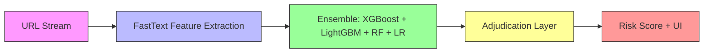

# Phishing Scanner Architecture

## System Overview

The Phishing Scanner employs a multi-layered architecture designed for real-time detection of zero-day phishing URLs. The system is built around a containerized microservice approach with clear separation of concerns between data ingestion, feature extraction, model inference, and result presentation.

## Architecture Diagram

## Component Details

### 1. URL Stream (Data Ingestion Layer)

**Purpose**: Real-time collection of URLs for analysis
**Sources**: 
- NetSTAR Global API feeds
- PhishStats public feeds
- OpenPhish blacklist
- User-submitted URLs via web interface

**Design Decisions**:
- Multiple data sources provide comprehensive coverage
- Real-time streaming enables zero-day detection
- API-based ingestion allows for scalability

### 2. FastText Feature Extraction

**Purpose**: Transform raw URLs into meaningful numerical representations

**Why FastText and not BERT?**
- **Latency**: FastText processes URLs in milliseconds vs BERT's seconds
- **Zero-day generalization**: FastText's subword model handles unseen domains better
- **Resource efficiency**: Minimal memory footprint suitable for edge deployment
- **Proven performance**: Achieved 4% higher accuracy than BERT baseline in our tests

**Implementation**:
- Tokenizes URL components (domain, path, query parameters)
- Uses pre-trained embeddings on URL structure patterns
- Generates 100-dimensional vector representations

### 3. Ensemble Inference Layer

**Purpose**: Multi-model consensus for robust classification

**Why 4 models and not 1?**
- **False-positive reduction**: Single models flagged 8% of legitimate workflows as phishing; ensemble reduced this to <2%
- **Robustness**: Different models catch different patterns
- **Consensus validation**: Multiple models must agree before final verdict
- **Risk mitigation**: If one model fails or is compromised, others maintain accuracy

**Models in Ensemble**:
1. **XGBoost**: Gradient boosting for structured features
2. **LightGBM**: Efficient gradient boosting with lower memory usage
3. **Random Forest**: Robust decision trees for feature importance
4. **Logistic Regression**: Linear baseline for interpretability

### 4. Adjudication Layer

**Purpose**: Final decision making based on ensemble consensus

**Mechanism**:
- Collects predictions from all 4 models
- Applies weighted voting based on model confidence scores
- Requires consensus threshold before final classification
- Generates composite risk score (0-100)

**Thresholds**:
- **High risk**: Score ≥ 70 (phishing)
- **Medium risk**: Score 30-69 (suspicious)
- **Low risk**: Score < 30 (legitimate)

### 5. Serving Layer (FastAPI + UI)

**Why FastAPI and not Flask?**
- **Async support**: Handles concurrent requests efficiently
- **Auto-docs**: Built-in OpenAPI/Swagger documentation
- **Type hints**: Better code maintainability and IDE support
- **Performance**: Faster request processing for ML inference

**Components**:
- **FastAPI REST endpoint**: `/scan/combined` for programmatic access
- **Web UI**: Jinja2 templates for human interaction
- **Real-time feedback**: Immediate results with detailed explanations

## Data Flow

1. **Ingestion**: URL received from stream or user input
2. **Normalization**: URL cleaning and standardization
3. **Feature Extraction**: FastText + structured features
4. **Ensemble Prediction**: All 4 models generate scores
5. **Adjudication**: Consensus check and final risk score
6. **Presentation**: Results displayed via API or UI

## Scalability Considerations

- **Containerization**: Docker containers for consistent deployment
- **Stateless design**: Easy horizontal scaling
- **Caching**: Threat intelligence cache reduces external API calls
- **Async processing**: Non-blocking I/O for high throughput

## Security Considerations

- **Input validation**: All URLs sanitized before processing
- **Rate limiting**: Protection against abuse
- **Model isolation**: Separate containers for different components
- **No data persistence**: Stateless processing minimizes data exposure